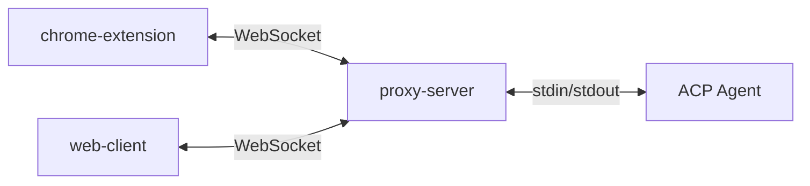

# AGENTS.md

## Architecture

Chrome ACP is a Bun monorepo with 4 packages:

- **chrome-extension** - Chrome MV3 extension with sidepanel UI
- **web-client** - Web client served by proxy-server
- **shared** - Shared UI components and utilities
- **proxy-server** - WebSocket server that bridges clients to ACP agents



**Why proxy-server?**
Chrome extensions run in a browser sandbox and cannot spawn subprocesses. The proxy-server acts as a local bridge, spawning the ACP agent subprocess and relaying communication via WebSocket.

## Tech Stack

- **Bun** - Package manager and build tool (not runtime, to support Android Termux which only has Node.js)
- **React + TypeScript + Tailwind CSS**
- **[shadcn/ui](https://ui.shadcn.com/)** - Base UI component library
- **[Vercel AI Elements](https://elements.ai-sdk.dev/)** - AI chat components (Conversation, Message, CodeBlock, Reasoning, etc.)
- **Hono** - HTTP/WebSocket server framework for proxy-server

### Best Practices

- Use Bun as the package manager. Install dependencies with `bun add`, never edit package.json manually.
- Keep UI code DRY. Shared components go in `packages/shared` and are imported by other packages.
- Do not use Bun-specific APIs. The code must run on Node.js (for Termux compatibility).
- Prefer [shadcn/ui](https://ui.shadcn.com/) and [Vercel AI Elements](https://elements.ai-sdk.dev/) for UI components. Use their CLIs with Bun:
  ```bash
  bunx --bun shadcn@latest add <component>
  bunx --bun ai-elements@latest add <component>
  ```

## Bun Workspace

This is a Bun monorepo using `workspaces` to manage multiple packages.

**All commands run from the root directory:**

```bash
# Install dependencies
bun install

# Build all packages
bun run build

# Build individual packages
bun run build:extension
bun run build:proxy
bun run build:web

# Development mode
bun run dev
```

Packages reference each other via the `@chrome-acp/*` namespace:
```json
{
  "dependencies": {
    "@chrome-acp/shared": "workspace:*"
  }
}
```

## Build & Release

```bash
# Build all packages
bun run build

# Release a new version (updates manifest.json + package.json, tags, and pushes)
just release <version>
# Example: just release 1.0.30
```

After release, GitHub Actions automatically builds and uploads release artifacts.
