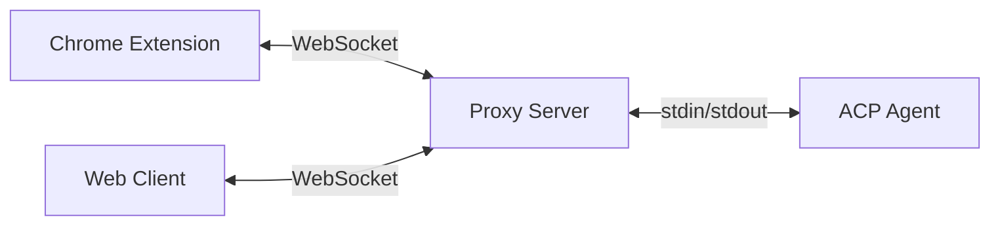

# Chrome ACP

A Chrome extension to chat with AI agents. Give them the power to see and interact with your browser.

Built on [ACP](https://agentclientprotocol.com).

## Quick Start

To use Chrome ACP, you need:
- `@chrome-acp/proxy-server` — The proxy that bridges browser ↔ agent
- An ACP-compatible agent (e.g. Claude Code + its ACP adapter)

```bash
# Install
npm install -g @chrome-acp/proxy-server @anthropic-ai/claude-code @zed-industries/claude-code-acp

# Start
acp-proxy --no-auth claude-code-acp
```

Then open http://localhost:9315 in your browser.

### Use the Chrome Extension

For full browser control (reading tabs, executing scripts), use the extension:

1. Download `chrome-extension.zip` from [Releases](https://github.com/Areo-Joe/chrome-acp/releases)
2. Unzip and load in `chrome://extensions` (enable Developer mode → Load unpacked)
3. Click the extension icon → Connect to your running proxy

## Features

- **Works with any ACP-compatible agent** — Claude Code, OpenCode, Gemini CLI, and more
- **Runs anywhere with Node.js** — Local machine, server, even Termux on Android
- **Operates as you** — Agents interact with pages using your real browser session (spoiler: crawler!)

## Architecture



## CLI Options

| Option | Default | Description |
|--------|---------|-------------|
| `--port` | `9315` | Server port |
| `--host` | `localhost` | Host to bind (use `0.0.0.0` for network access) |
| `--https` | `false` | Enable HTTPS with self-signed certificate (for LAN only) |
| `--public-url` | - | Public WebSocket URL for QR code (e.g., `wss://example.com/ws`) |
| `--no-auth` | `false` | Disable authentication (safe for localhost, dangerous for remote) |
| `--termux` | `false` | Auto-launch PWA via Termux on Android |
| `--debug` | `false` | Enable debug logging to file |

## Remote Access

For accessing from other devices on your network (e.g., mobile):

```bash
acp-proxy --https --host 0.0.0.0 <agent-command>
```

The server prints URLs with embedded auth tokens and a QR code for mobile connection.

> **Note:** HTTPS is required for camera access (QR scanning) on mobile devices.

### Termux (Android)

```bash
acp-proxy --termux <agent-command>
```

Auto-launches the PWA after server starts.

## Browser Tools

The extension exposes browser tools to agents via MCP:

| Tool | Description |
|------|-------------|
| `browser_tabs` | List all open tabs (id, url, title, active status) |
| `browser_read` | Read DOM content of a tab as simplified Markdown |
| `browser_execute` | Execute JavaScript in a tab's page context |

**Usage flow:**
1. Agent calls `browser_tabs` to list available tabs
2. Agent calls `browser_read` with a `tabId` to read page content
3. Agent calls `browser_execute` with a `tabId` and `script` to interact with the page

> **Note:** Browser tools require the Chrome extension. They are not available in the web client.

## Supported Agents

<details>
<summary><b>Claude Code</b> — Anthropic's agentic coding tool</summary>

```bash
npm install -g @chrome-acp/proxy-server @anthropic-ai/claude-code @zed-industries/claude-code-acp
acp-proxy --no-auth claude-code-acp
```
</details>

<details>
<summary><b>Codex CLI</b> — OpenAI's coding agent</summary>

```bash
npm install -g @chrome-acp/proxy-server @openai/codex @zed-industries/codex-acp
acp-proxy --no-auth codex-acp
```
</details>

<details>
<summary><b>OpenCode</b> — Open-source terminal AI assistant</summary>

```bash
npm install -g @chrome-acp/proxy-server
curl -fsSL https://opencode.ai/install | bash
acp-proxy --no-auth opencode acp
```
</details>

<details>
<summary><b>Gemini CLI</b> — Google's AI agent (free tier available)</summary>

```bash
npm install -g @chrome-acp/proxy-server @google/gemini-cli
acp-proxy --no-auth gemini -- --experimental-acp
```
</details>

<details>
<summary><b>Qwen Code</b> — Free coding agent using Qwen models</summary>

```bash
npm install -g @chrome-acp/proxy-server @qwen-code/qwen-code@latest
acp-proxy --no-auth qwen -- --acp
```
</details>

<details>
<summary><b>Augment Code</b> — AI coding agent by Augment</summary>

```bash
npm install -g @chrome-acp/proxy-server @augmentcode/auggie
acp-proxy --no-auth auggie -- --acp
```
</details>

Any [ACP-compatible agent](https://agentclientprotocol.com/get-started/agents) works with Chrome ACP.

## Development

```bash
# Build all packages
bun run build

# Build individual packages
bun run build:extension  # Chrome extension
bun run build:proxy      # Proxy server
bun run build:web        # Web client

# Development mode (extension with hot reload)
bun run dev

# Release new version
just release <version>
```

## Packages

This is a Bun monorepo with four packages:

| Package | Description |
|---------|-------------|
| [`packages/chrome-extension`](./packages/chrome-extension) | Chrome extension with sidepanel chat UI |
| [`packages/web-client`](./packages/web-client) | PWA web client served by proxy server |
| [`packages/shared`](./packages/shared) | Shared UI components and utilities (`@chrome-acp/shared`) |
| [`packages/proxy-server`](./packages/proxy-server) | WebSocket proxy server (npm: `@chrome-acp/proxy-server`) |

## License

MIT
