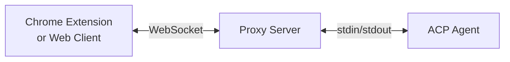

Chrome ACP is a Chrome extension that lets you chat with AI agents and give them the power to see and interact with your browser.

Built on the [Agent Client Protocol (ACP)](https://agentclientprotocol.com), it works with any ACP-compatible agent including Claude Code, OpenCode, Gemini CLI, and more.

## Why Chrome ACP?

### Works with Any ACP Agent

Chrome ACP isn't tied to a single AI provider. It works with any agent that implements the ACP protocol:

- **Claude Code** - Anthropic's agentic coding tool
- **OpenCode** - Open-source terminal AI assistant
- **Gemini CLI** - Google's AI agent (free tier available)
- **Codex CLI** - OpenAI's coding agent
- And many more...

### Runs Anywhere

Chrome ACP runs anywhere Node.js runs:

- Your local development machine
- Remote servers
- Even Termux on Android!

### Operates as You

Agents interact with web pages using your real browser session. This means:

- No need for separate credentials
- Access to authenticated pages
- Full browser capabilities

## How It Works

The **Proxy Server** acts as a bridge between the browser and the AI agent:

1. **Browser → Proxy**: Your messages are sent via WebSocket
2. **Proxy → Agent**: The proxy spawns the agent process and communicates via stdin/stdout
3. **Agent → Browser**: Agent responses flow back through the same path

This architecture is necessary because Chrome extensions run in a sandbox and cannot spawn subprocesses directly.

## Next Steps

Ready to get started? Head to the [Quick Start](/chrome-acp/getting-started/quick-start/) guide.

